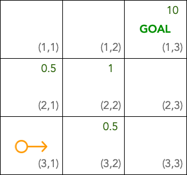

Kandula
#######

Kandula is a Python package for general Reinforcement Learning (RL). It can be used to train an RL agent for any problem that can be mapped to RL.

Usage
#####

.. code:: bash

    pip install kandula

If the problem at hand can be satisfy main RL requirements, then
it can be solved via RL and hence Kandula can be hte right solution. Otherwise, other approaches in ML might be more applicable.

To solve your problem via RL, you should be able to define a **state space**, a set of **actions**, and a **reward function** such that the actions change
the state of the problem and the reward function assigns a reward to each action.  

State Space
~~~~~~~~~~~~
The first thing that we should consider is mapping our problem to a state space. There are two ways to define the state for your problem.
The first way is via a state vector of arbitrary size made of natural numbers {1, 2, 3, ...}. A classic example is the following grid. As you see, 
our space is 2-dimensional, each state has an index and in total there are 9 states. The goal of the agent is to reach the GOAL state where it receives a
reward of 10. The agent has 4 actions available to it which are moving to the LEFT, RIGHT, DOWN, UP. Each time the agent takes one of these actions,
a reward function calculates the distance of the new state and the goal state and accordingly assigns a reward to the agent.

Actions
~~~~~~~~~~~

Rewards
~~~~~~~

Examples
~~~~~~~~
You can see two worked examples of training an RL agent to learn to multiply and to learn to predict country capitals in `these notebooks <./notebooks>`__.
